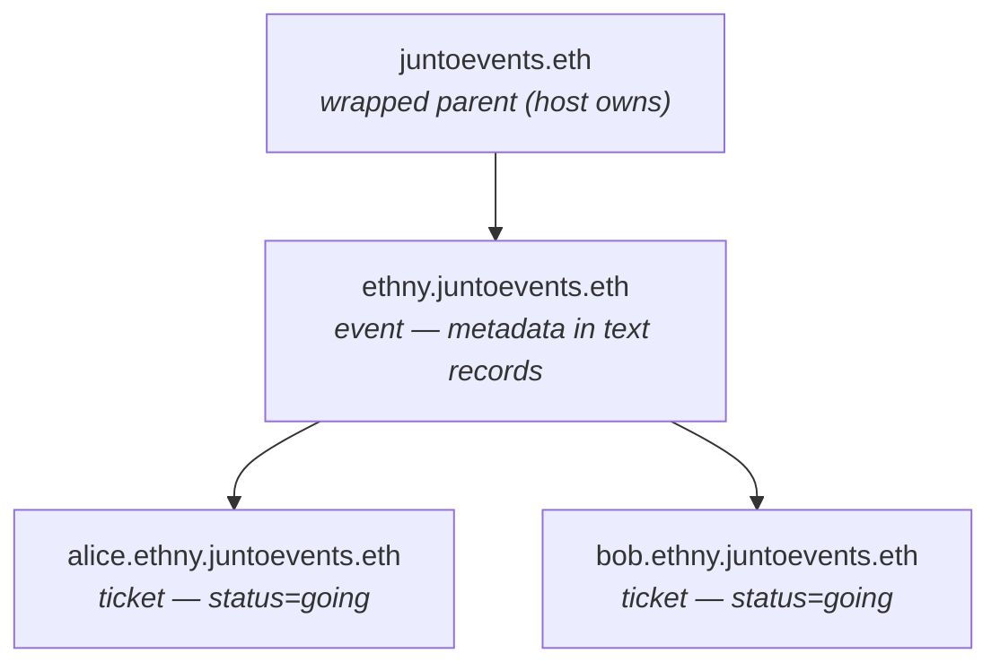
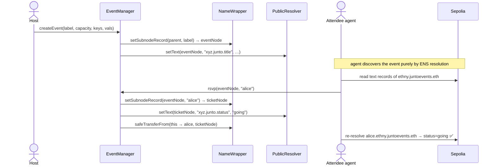
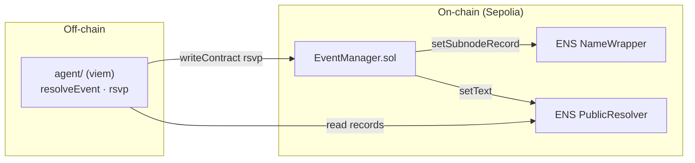

# Junto

**Luma/Meetup, rebuilt on ENS.** An event *is* an ENS subname; an RSVP *is* an on-chain
subname minted under it. All event data lives in ENS resolver records — there is no
off-chain database, and nothing is hard-coded. ENS-named agents discover events by
resolution and RSVP to each other on their owner's behalf.

## Name hierarchy



Resolution alone tells the whole story: resolve an event → read its records → RSVP →
a ticket subname appears under it, owned by the attendee.

## Why ENS, on both sides

- **Events as names** — `ethny.juntoevents.eth` carries metadata in text records
  (`xyz.junto.title`, `.location`, `.capacity`, …).
- **Tickets as subnames** — RSVPing mints `alice.ethny.juntoevents.eth`, owned by the
  attendee, carrying `xyz.junto.status = going`.
- **People as names** (the vision) — each agent represents a person via *their* ENS profile.
  The agent reads its owner's interests/location/socials from their ENS records, matches them
  against event records, and surfaces a **curated, personalized** shortlist before RSVPing.
  ENS is the identity layer *and* the discovery layer.

## End-to-end flow (Iter 1 — paymentless)



## Architecture



## Status — iterative build

- ✅ **Iter 1 (current): paymentless end-to-end.** Create an event subname with metadata
  records; RSVP mints a ticket subname owned by the attendee; capacity enforced on-chain.
  An agent resolves the event by name, RSVPs, and re-resolves the new ticket to confirm
  `status=going`.
- ⬜ **Iter 2 — ENS depth.** Soulbound tickets (`CANNOT_TRANSFER` fuse), an ABI record on the
  event node for agent self-discovery, reverse resolution in the UI.
- ⬜ **Iter 3 — AI personalization + payment.** Read the owner's ENS profile, curate events
  with an LLM, optional USDC ticket payment to the host treasury (addr record).
- ⬜ **Iter 4 — Reputation/discovery.** ERC-8004 identity + reputation keyed to ENS; index
  events for agent discovery.

## Layout

```
contracts/   Foundry: EventManager.sol + deploy/create scripts + tests
agent/        viem TS client: resolve an event, RSVP, verify the ticket subname
web/          Vite + React UI: browse an event, RSVP from a wallet, see ticket subnames
assets/       logo, cover, and screenshots
```

## Run it

```bash
# 1. Contracts
cd contracts
forge install                   # fetch forge-std (from .gitmodules) after a fresh clone
cp .env.sample .env             # fill DEPLOYER_PRIVATE_KEY, SEPOLIA_RPC_URL, PARENT_NODE
forge test                      # 6 logic tests (mocked ENS), no network needed

forge script script/Deploy.s.sol      --rpc-url sepolia --broadcast   # deploy + approve manager on parent
forge script script/CreateEvent.s.sol --rpc-url sepolia --broadcast   # create an event from .env values

# 2. Agent
cd ../agent
cp .env.sample .env             # fill PRIVATE_KEY, SEPOLIA_RPC_URL, EVENT_MANAGER
pnpm install
pnpm tsx src/resolveEvent.ts ethny.juntoevents.eth        # read event records
pnpm tsx src/rsvp.ts          ethny.juntoevents.eth alice # RSVP -> mints alice.ethny.juntoevents.eth
```

Cross-check the resulting ticket subname on https://sepolia.app.ens.domains.

```bash
# 3. Web UI (reads live data; defaults point at the deployed contract)
cd ../web
pnpm install
pnpm dev          # http://localhost:5183 — browse the event, RSVP from a wallet
```

The UI reads event metadata from ENS records and the attendee list from `RSVP` logs, and
RSVPs by calling the contract from an injected wallet (MetaMask) on Sepolia — no backend.

## Live on Sepolia

The full loop is deployed and verified end-to-end (paymentless):

| Thing | Value |
|---|---|
| Parent name | `juntoevents.eth` (registered + wrapped) |
| `EventManager` | [`0xd1CF5206ea14DA67cd2c58796F7B34A45802F1d6`](https://sepolia.etherscan.io/address/0xd1CF5206ea14DA67cd2c58796F7B34A45802F1d6) |
| Example event | `ethny.juntoevents.eth` |
| Example ticket | `alice.ethny.juntoevents.eth` → `xyz.junto.status = "going"` |

Verified agent run: discover event by ENS resolution → `rsvp()` mints the ticket subname →
re-resolve confirms `status=going` (see `assets/screenshot-3-agent.png`).

## Prerequisite

A **wrapped 2LD on Sepolia** (we use `juntoevents.eth`) owned by the deployer key, funded
with Sepolia faucet ETH. This is the parent the `EventManager` mints events under.

## Contract surface (`EventManager`)

- `createEvent(label, capacity, keys[], values[])` → mints the event subname, writes metadata
  records, records host/capacity. Event node is held by the contract so it can mint tickets.
- `rsvp(eventNode, attendeeLabel)` → mints the ticket subname to the contract, sets
  `xyz.junto.status = going`, transfers the ticket to the attendee, increments the count
  (capacity `0` = uncapped).

Sepolia ENS deployments used: NameWrapper `0x0635…fcE8`, PublicResolver `0xE996…49b5`,
ETHRegistrarController `0xfb3c…f968`.
